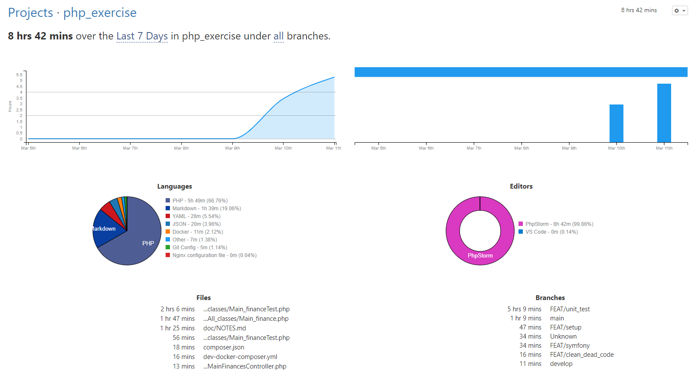

# Solution Procces:

## First Thoughts:

In the first approach my plan will have the following steps:

1. I am going to set up a docker environment with two nginx server, each one with the required compatible php versions and phpunit
1. The first analysis of the code shows that we have dead code. The right thing to do is delete it, to not make more complex 
the code and the process. Obviously the deletion of code always have more analysis than a simple single file class but if it was a core code 
I'll take the precaution of make a TAG or commit in the delete step to recover the code if it will be necessary.
1. The next step is to make unit test to our business logic and then start refactoring to adapt from php5 to php7 and improve the code, because we have
smells codes, some are pretty clear but all of them showed by our IDE(phpstorm). At first sight we are not going to have serious incompatibilities with the php version
1. The last step is to set up a symfony application and structure the code with a good architecture and good practices.
1. improve documentation 


### Step 1

I suffer a docker update so takes me more time.

I setup two environments to enable run:

    $ docker-compose --project-name php7 -f dev-docker-composer-php7.yml up
 
    $ docker-compose --project-name php5 -f dev-docker-composer-php5.yml up

To not employ more time in configuration I used my own docker images when it was possible, and I only put composer in one image

## Step 2

We only have 2 native functions dependency in our code: getdate() and floor() ( the old fashion constructor was deleted because it was unnecessary)
so we shouldn't have problems migrating.

To ensure I review 

* [change log from php5.0 to php7.0](https://www.php.net/manual/en/migration70.php)
* [change log from php7.0 to php7.1](https://www.php.net/manual/en/migration71.php)
* [change log from php7.1 to php7.2](https://www.php.net/manual/en/migration72.php)
* [change log from php7.2 to php7.3](https://www.php.net/manual/en/migration73.php)
* [change log from php7.3 to php7.3](https://www.php.net/manual/en/migration74.php)

in index.php we have a bug because REQUEST_URI will return a relative route from server name starting with '/', so the endpoints are not reachable
I made a quick fix to prove it, It is not problematic because we are migrating to symfony, and we'll develop a new controller

> Because the update in the system I spent more time, so it's late, and I'll do it tomorrow the remain work

## Step 3

### Step 3.1
I'll make the test to proceed to refactor de code and then, with de code ensured and clean migrate to Symfony framework
without uncontrolled risks.

The analysis of the code show us that we have two functions: 
* return the current day in specific format
* a function that seems to return a price incremented by 20% whatever taxes you introduce it will be changed to 20% by parameter

the first function its clear, but the second I'll need to reduce de unnecessary temporary variables to understand better the desired functionality, 
so I'll make a test to keep the current result. The endpoint always return the same values because the price and tax are
hardcoded, so meanwhile I don't affect the client we'll be right.

### Step 3.2
With the test I determine that desired requirement of VAT are: calculate full price with a 20% taxes and return taxes charged
This code don't work properly on negative numbers or in the upper limits, so I am going to fix the behaviour.

I am not agreed with te interface of the function or the behaviour but I'm going to fix it and from then we could change the code.

### Step 3.3
The code pass all the test, we are going to refactor the code.

    Brake to dinner from 21 to 22

### Step 3.4
Refactor today function


## Step 4

install Symfony and configure it

I realise that the version installed, symfony 5 it is not compatible with php5 but, if the premise is to migrate to symfony,
and the minimum version that accept that php version it is not supported any more (3.4) I don't consider a good solution.
is heavier, have unnecessary dependencies and have abandoned packages. It was a mistake, and I have no time to fix it. I prove
with the test that the core code it is compatible with php5


## Step 4.1 

Taking advantage of my mistake I will migrate the code to  the new php74 styles.

## Step 5

Make a documentation to setup the environment 

SETUP Dockers

    docker-compose --project-name php7 -f dev-docker-composer-php7.yml up

List all the containers in the image

    docker ps 

Access to php service to execute tests

    docker exec -it php7_php-<NAME> /bin/sh

Execute test
```
/var/www/app # php vendor/phpunit/phpunit/phpunit --testdox
PHPUnit 9.5.2 by Sebastian Bergmann and contributors.

Warning:       Your XML configuration validates against a deprecated schema.
Suggestion:    Migrate your XML configuration using "--migrate-configuration"!

Main Finance (App\Tests\MainFinance)
 ✔ Today
 ✔ V a t

Time: 00:00.414, Memory: 8.00 MB

OK (2 tests, 21 assertions)
/var/www/app #
```


# Next steps

I'll notify that I have finish the basic task, but Tomorrow I would like to develop a hexagonal architecture. 
Of course, it has no sense in such a code and will be against pragmatism, but I'll do it for the pleasure of the academic purpose.


We could see the time employed in the project:

 "Reference: [wakatime](https://wakatime.com/@enrikerf)"